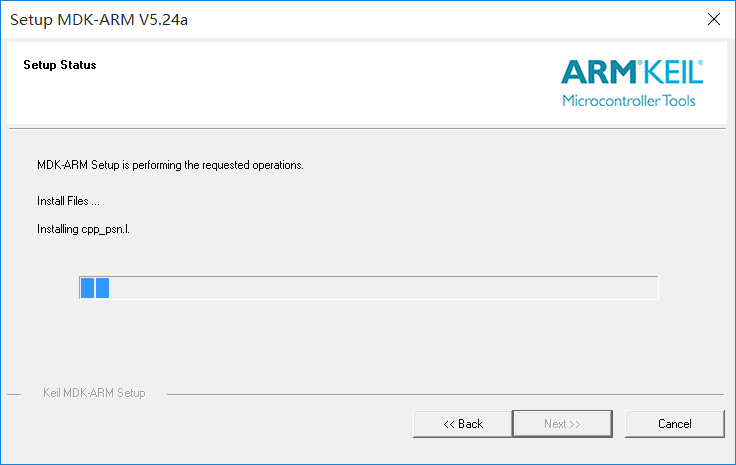
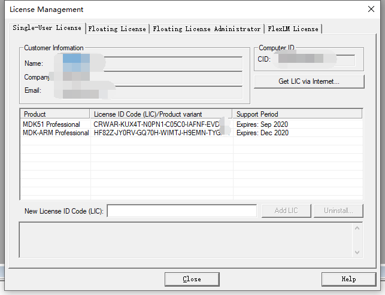
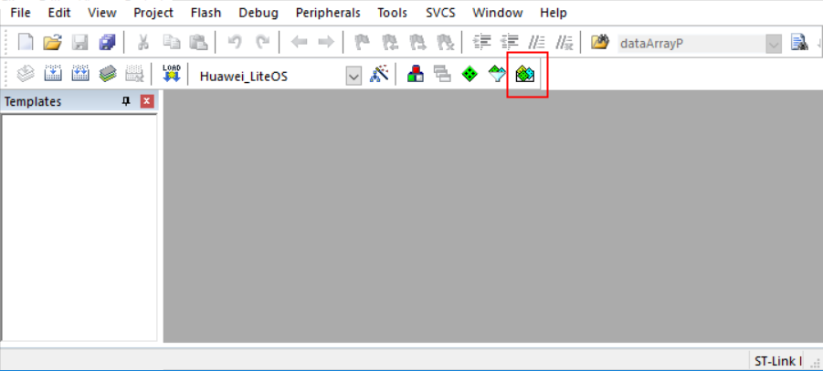
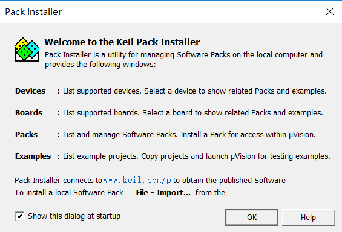
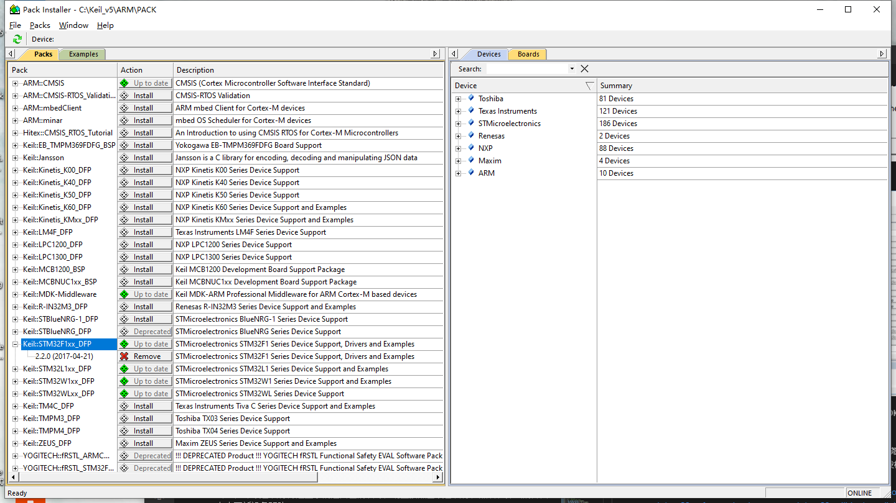
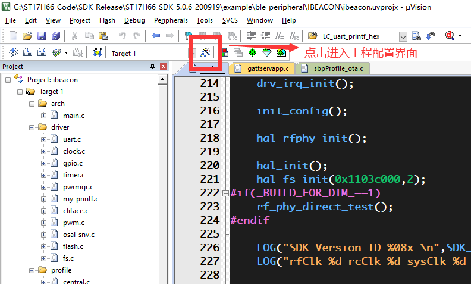
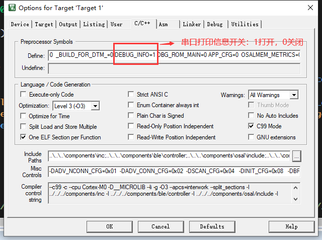
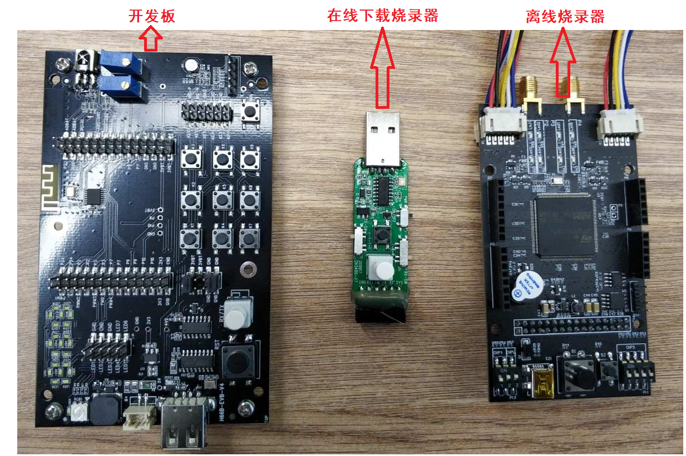

# `ST17H66_BT_SDK`

欢迎使用伦茨开源项目，在开始进入项目之前，请详细阅读SDK介绍文档，对伦茨系列芯片和SDK有大概认识，有助通过介绍快速上手。

为方便下载，提供百度云盘下载[ST17H66项目下载链接](https://pan.baidu.com/s/1AhewCj6NejWPhtIfEG4tCw)  
提取码：sr3x

## `1 ST17H66 BLE 固件程序`
本仓库包含SDK release 版本工程，线上线下同步发布。  
本工程提供例子包含GATT、串口透传、HID自拍、RGB灯、iBeacon。

## `2 工具链`

包含 `编译工具` 、 `在线下载工具` 、`离线烧录工具`、`测试工具`  :

1.  `编译工具`：`MDK` 即RealView MDK 或MDK-ARM（Microcontroller Development kit），是 ARM 公司收购Keil公司以后，基于uVision界面推出的针对ARM7、ARM9、Cortex-M0、Cortex-M1、Cortex-M2、Cortex-M3、Cortex-R4等ARM处理器的嵌入式软件开发工具。MDK-ARM 集成了业内最领先的技术，包括 uVision4 集成开发环境与 RealView 编译器RVCT。支持 ARM7、ARM9 和最新的Cortex-M3/M1/M0 核处理器，自动配置启动代码，集成 Flash 烧写模块，强大的 Simulation 设备模拟，性能分析等功能，与 ARM 之前的工具包 ADS 等相比，RealView 编译器的最新版本可将性能改善超过 20%。  
Keil公司开发的ARM开发工具MDK，是用来开发基于ARM核的系列微控制器的嵌入式应用程序。它适合不同层次的开发者使用，包括专业的应用程序开发工程师和嵌入式软件开发的入门者。MDK包含了工业标准的Keil C编译器、宏汇编器、调试器、实时内核等组件，支持所有基于ARM的设备，能帮助工程师按照计划完成项目。

2. `在线下载工具`：[Lekit.exe](./doc/development_docs/1，ST17H66开发套件入门及调试) ，用于开发调试时下载程序到目标板，查看打印信息，[2，ST17H66开发板烧写方法说明V1.1](./doc/development_docs/1，ST17H66开发套件入门及调试) 和 [3，ST17H66在线下载烧录器烧写方法说明V1.1](./doc/development_docs/1，ST17H66开发套件入门及调试)。
  
3. `离线烧录工具`：[LeWrite.exe](./doc/development_docs/4，ST17H66烧录) ，配合离线烧录器用于量产烧录，[1，ST17H66离线烧录-厂房烧录操作说明V1.0](./doc/development_docs/4，ST17H66烧录)。

4. `测试工具`：安卓用户搜索安装 `nRF Connect`，[安装包apk文件目录](./doc/tools)，IOS用户在App Store搜索安装 `Lightblue`，测试工具均为第三方开发，测试结果客观公正。

### `2.1 MDK安装`
登录MDK官网，下载MDK5软件，下载地址：
http://www2.keil.com/mdk5  或者 https://www.keil.com/download/product/
下载的版本最好在5.24以上，本开发教程以5.24版本为例，双击MDK524应用程序文件，点击next>>。

打上 I agree前面的勾勾，即是同意一些安装协议。点击next>>。

选择安装路径，可以默认也可以安装在我们自己建立的文件夹下（使用英文路径）。点击next>>。

这里填写相关信息，填写完成继续next>>。

等待安装完成即可。

安装完成，点击Finish。

然后跳出这个界面，先点OK，把弹窗界面关掉。

激活MDK，导入License激活MDK后便可使用了。

`特别提示`：一定要输入License激活MDK软件，否则试用版会有编译空间限制，建议购买正版License。

### `2.2 安装MDK芯片支持包`
安装完MDK后，需要安装芯片对应的ARM支持包（pack）。  
- 方式一 登录官网：http://www.keil.com/dd2/pack/ 下载 `keil.STM32F1xx_DFP.2.2.0.pack`后安装，双击运行，默认路径点击next>>等待安装完成。
- 方式二 在线安装：打开软件，在导航栏打开pack安装管理界面，然后选择OK选项。

进入在线安装界面，选择`Keil::STM32F1xx_DFP`，点击`install`进行安装。

至此，开发编译环境已经搭建完毕，重启MDK软件就可以编译工程了。

## `3 文档介绍`

文档路径为<\BLE5_ST17H66\doc\development_docs>

1. [ST17H66 Soc数据手册](./doc/development_docs/3，ST17H66参考资料)
2. [ST17H66 SDK简介](./doc/development_docs/3，ST17H66参考资料)
3. [ST17H66 开发常见问题](./doc/development_docs/3，ST17H66参考资料/3，ST17H66开发常见问题.md)
   
## `4 工程编译`

目前SDK包含工程 

1. HID自拍：适用于遥控器，自拍器
2. GATT数传：适用于与APP通过拟定协议
3. Uart透传：适用于小型模块
4. Becon设备: 适用于信标 
   
以becon工程为例编译工程。
进入<SDK_ST17H66_private\ST17H66_SDK_5.0.6_200919\example\ble_peripheral\IBEACON>目录，打开`ibeacon.uvprojx`

配置工程

点击编译按钮编译工程，最终目标文件在<ST17H66_SDK_5.0.6_200919\example\ble_peripheral\IBEACON\bin>目录。

## `5 蓝牙认证`

## `6 硬件获取`

* 开发套件

1. 开发板
2. 在线下载烧录器
3. 离线烧录器

获取途径：https://www.lenzetech.com/

   
## `7 技术支持`

    ST17H66服务免费。  
    当您遇到问题时，请联系我们寻求相应的帮助。
    联系方式

    邮箱: <yangqi@lenzetech.com>

    技术支持可联系销售业务提供。

