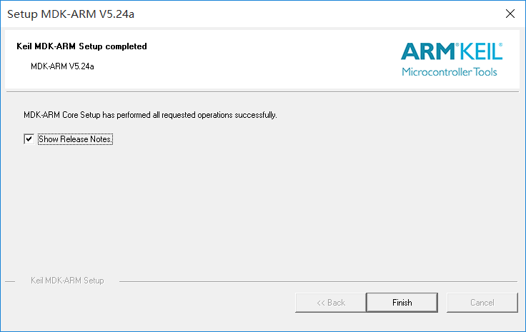
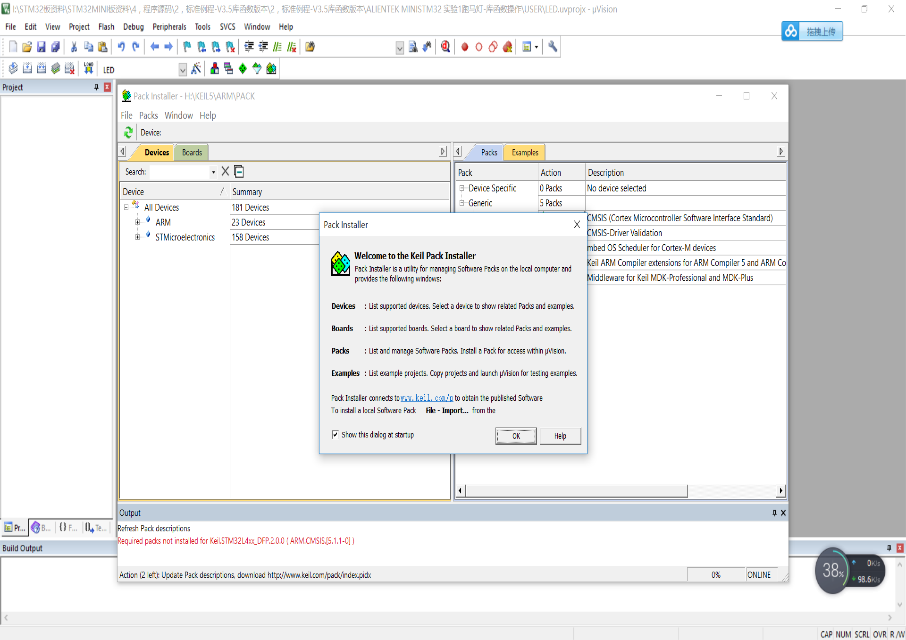

# ST17H65_6_SDK开发环境

## 1 工具链

包含 编译工具 、 在线下载工具 、离线烧录工具、测试工具  :

1.  编译工具：MDK 即RealView MDK 或MDK-ARM（Microcontroller Development kit），是 ARM 公司收购Keil公司以后，基于uVision界面推出的针对ARM7、ARM9、Cortex-M0、Cortex-M1、Cortex-M2、Cortex-M3、Cortex-R4等ARM处理器的嵌入式软件开发工具。MDK-ARM 集成了业内最领先的技术，包括 uVision4 集成开发环境与 RealView 编译器RVCT。支持 ARM7、ARM9 和最新的Cortex-M3/M1/M0 核处理器，自动配置启动代码，集成 Flash 烧写模块，强大的 Simulation 设备模拟，性能分析等功能，与 ARM 之前的工具包 ADS 等相比，RealView 编译器的最新版本可将性能改善超过 20%。  
Keil公司开发的ARM开发工具MDK，是用来开发基于ARM核的系列微控制器的嵌入式应用程序。它适合不同层次的开发者使用，包括专业的应用程序开发工程师和嵌入式软件开发的入门者。MDK包含了工业标准的Keil C编译器、宏汇编器、调试器、实时内核等组件，支持所有基于ARM的设备，能帮助工程师按照计划完成项目。

1. 在线下载工具：[3、开发环境搭建_工具下载 -> Lekit.exe] ，用于开发调试时下载程序到目标板，查看打印信息，[7、开发文档 -> ST17H66开发板烧写方法说明] 和 [7、开发文档 -> ST17H66在线下载烧录器烧写方法说明]。
  
2. 离线烧录工具：[5、烧录 -> LeWrite.exe] ，配合离线烧录器用于量产烧录，文档见 [5，烧录 -> ST17H65_6脱机烧录工具说明]。
3. 测试工具：安卓用户搜索安装 nRF Connect，IOS用户在App Store搜索安装 Lightblue，测试工具均为第三方开发，测试结果客观。

### 1.1 MDK安装
登录MDK官网，下载MDK5软件，下载地址：
http://www2.keil.com/mdk5  或者 https://www.keil.com/download/product/
下载的版本最好在5.24以上，本开发教程以5.24版本为例，双击MDK524应用程序文件，点击next>>。

打上 I agree前面的勾勾，即是同意一些安装协议。点击next>>。

选择安装路径，可以默认也可以安装在我们自己建立的文件夹下（使用英文路径）。点击next>>。

这里填写相关信息，填写完成继续next>>。

等待安装完成即可。

安装完成，点击Finish。

然后跳出这个界面，先点OK，把弹窗界面关掉。

激活MDK，导入License激活MDK后便可使用了。

特别提示：一定要输入License激活MDK软件，否则试用版会有编译空间限制，建议购买正版License。

### 1.2 安装MDK芯片支持包
安装完MDK后，需要安装芯片对应的ARM支持包（pack）。  
- 方式一 登录官网：http://www.keil.com/dd2/pack/ 下载 keil.STM32F1xx_DFP.2.2.0.pack后安装，双击运行，默认路径点击next>>等待安装完成。
- 方式二 在线安装：打开软件，在导航栏打开pack安装管理界面，然后选择OK选项。

进入在线安装界面，选择Keil::STM32F1xx_DFP，点击install进行安装。

至此，开发编译环境已经搭建完毕，重启MDK软件就可以编译工程了。

## `2 硬件获取`

* 开发套件

1. 开发板
2. 在线下载烧录器
3. 离线烧录器

